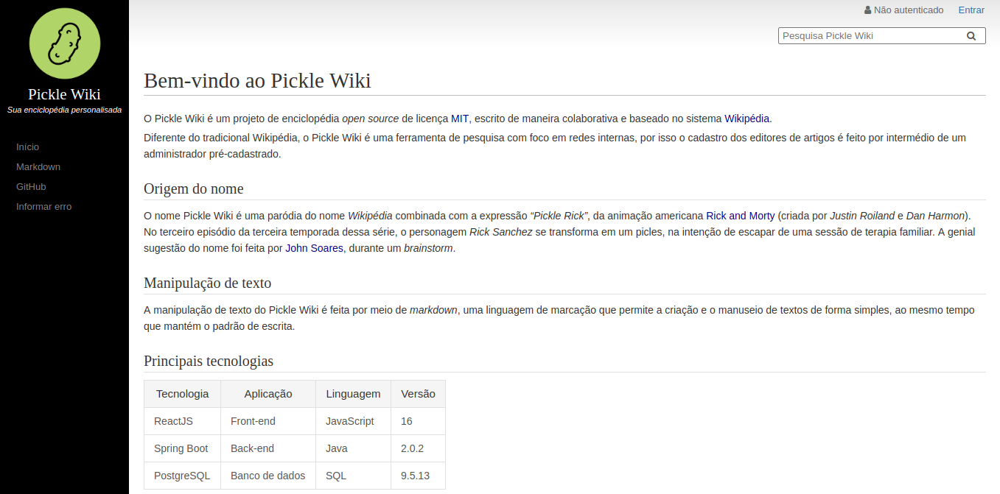

# Pickle Wiki

The Pickle Wiki is an open source encyclopedia project, written collaboratively and based on the *Wikipedia* system. Unlike the traditional *Wikipedia*, the Pickle Wiki is a search tool with a focus on internal networks.

The application's name is a parody of the name *Wikipedia* combined with the expression *"Pickle Rick"* from the American animation [Rick and Morty](https://en.wikipedia.org/wiki/Rick_and_Morty) (created by *Justin Roiland* and *Dan Harmon*). The genial suggestion of the name was made by [John Soares](https://github.com/JohnSoares) during a brainstorm.

## Tecnology

The Pickle Wiki is a single page application which uses **React JS** as front-end and **Spring Boot** as back-end. To data persistence it  was chosen the **PostgresSQL** and to make text handling it was chosen the **Markdown**.

## Idioms
At the moment, the texts of the systems are all in Brazilian Portuguese.

## Screenshot

